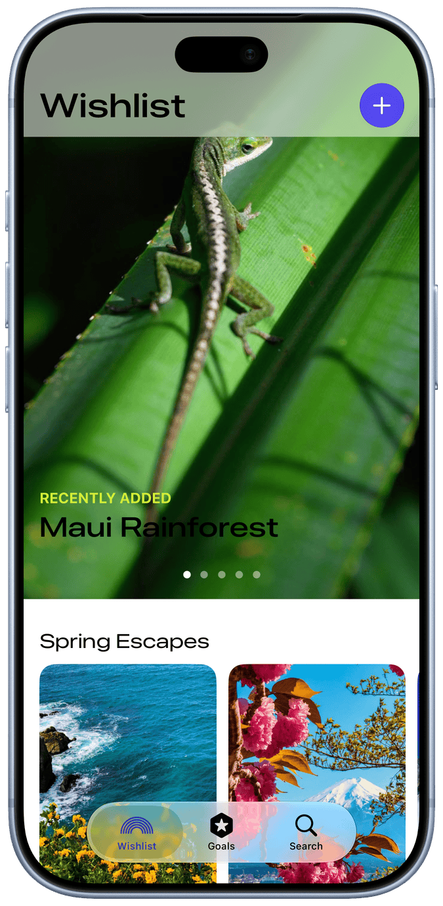

# PreviewBezel

一鍵把 Xcode Preview 截圖套上 iPhone bezel 外框,並複製到剪貼簿。

按下 Xcode 裡綁定的快捷鍵(例如 ⌘P),就會自動:

1. 取得乾淨的 preview 渲染圖(無狀態列、Dynamic Island 為黑色藥丸),依序嘗試兩種來源:
   - **Xcode 官方 MCP server**(`xcrun mcpbridge`)的 `RenderPreview` 工具
   - 備援:AppleScript 點擊 Xcode 選單 **Editor ▸ Canvas ▸ Copy Preview Screenshot**
2. 自動偵測 `bezel.png` 的透明螢幕區域,把截圖以 aspect-fill 合成進去
3. 合成結果存到 `.build/last-output.png`,同時以 PNG + TIFF 放回剪貼簿,直接貼到 Slack、簡報或社群

## 安裝

1. Clone 這個 repo
2. 在 Xcode ▸ Settings ▸ Intelligence ▸ Model Context Protocol 啟用 **Xcode Tools**(MCP 來源需要;Xcode 26.3+)
3. 在 Xcode ▸ Settings ▸ Behaviors 新增一個 behavior,勾選 **Run**,選擇 `preview-bezel.sh`,並綁定快捷鍵(建議 ⌘P)
4. (備援方案才需要)若走選單方案時系統詢問「輔助使用」(Accessibility)權限,請允許;若沒有跳出詢問但執行失敗,到「系統設定 ▸ 隱私權與安全性 ▸ 輔助使用」手動把 Xcode 打開

> MCP 來源的快照解析度由 Xcode 決定,可能低於裝置原生解析度(合成時會放大);若在意畫質,可關閉 Xcode Tools 讓工具改走選單方案,取得原生 3x 解析度的截圖。

### 關於「Allow "preview-bezel" to access Xcode?」授權視窗

正式版 Xcode 對每次新啟動的 agent 連線都會跳授權視窗,沒有「永久允許」機制。本工具做了兩層處理:

1. 編譯後自動用 Apple Development 憑證重簽 binary(可用 `PREVIEW_BEZEL_SIGN_ID` 指定憑證),讓簽章身分穩定
2. 執行時背景偵測授權視窗,確認內容包含本工具路徑後**自動點擊 Allow**(只點自己的,不會誤點其他 agent 的授權視窗;需要輔助使用權限)

## 使用

1. 在 Xcode 打開 SwiftUI 檔案,讓 Canvas preview 跑起來
2. 按下綁定的快捷鍵
3. 收到「已合成並複製到剪貼簿」通知後直接貼上即可

## 更換 bezel

把 `bezel.png` 換成任何「螢幕區域為透明」的裝置外框圖即可,程式會自動偵測透明區域的位置與大小,不需要改程式碼。

目前附的 `bezel.png` 是 **iPhone 17 Pro(宇宙橙)**,來自 [Apple Design Resources](https://developer.apple.com/design/resources/) 的產品外框素材,螢幕挖洞剛好是 1206×2622,與 preview 截圖 1:1。使用時請遵守 Apple Design Resources 的授權條款。

## 運作原理

- `preview-bezel.sh`:入口腳本,原始碼有更新時自動用 `swiftc` 重新編譯,再執行 binary
- `PreviewBezel.swift`:核心邏輯
  - **MCP 來源**:內建一個極簡 MCP client(JSON-RPC over stdio),連上 `xcrun mcpbridge` 後依序呼叫 `XcodeListWindows` → `XcodeGetCurrentFile`(取得目前編輯中的 .swift 檔)→ `RenderPreview`(渲染該檔第一個 `#Preview`),讀取回傳的 `previewSnapshotPath`
  - **選單備援**:用 AppleScript(System Events)點擊 Copy Preview Screenshot,輪詢剪貼簿 `changeCount` 取得截圖
  - 讀取 bezel 圖的 alpha channel,從中心往四周走出螢幕的透明矩形(垂直方向取螢幕寬度 18%–82% 的直欄,避開 Dynamic Island)
  - 從影像邊界 flood fill 找出手機輪廓以外的區域,清除 aspect-fill 溢出的像素(螢幕是圓角,外接矩形的四角會超出輪廓)
  - 最後把 bezel 疊在最上層,輸出 PNG 並寫入剪貼簿

> 註:Editor 選單有兩個同名的「Canvas」項目(顯示開關與子選單),而且 AppleScript 會把存進變數的索引引用改寫成名稱引用,所以選單存取全部使用行內索引鏈,細節見 `PreviewBezel.swift` 的註解。
