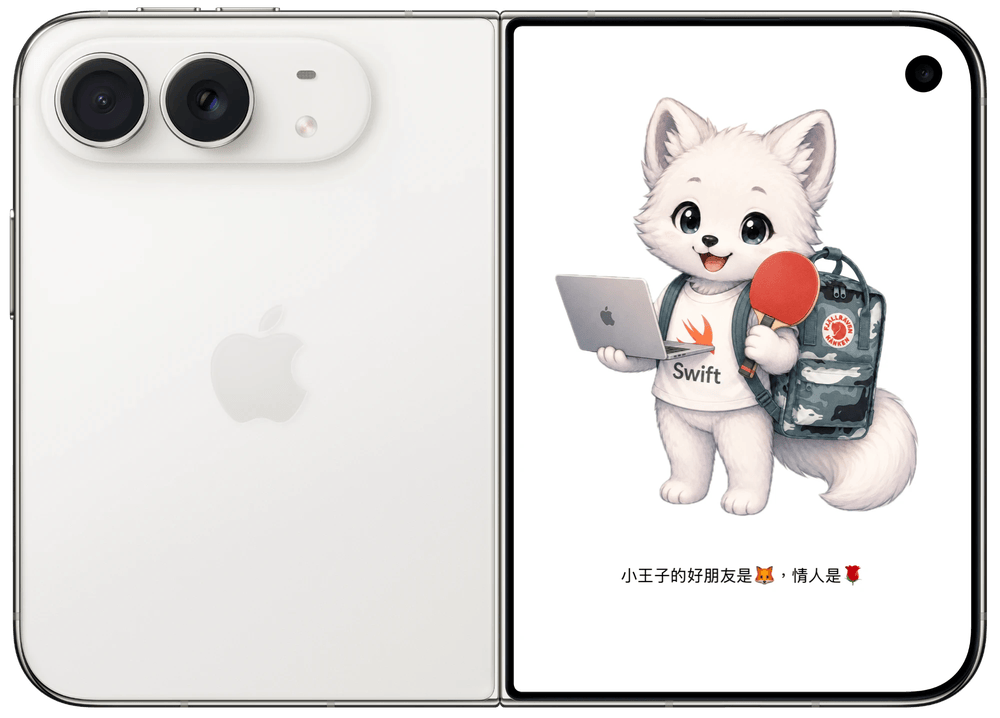
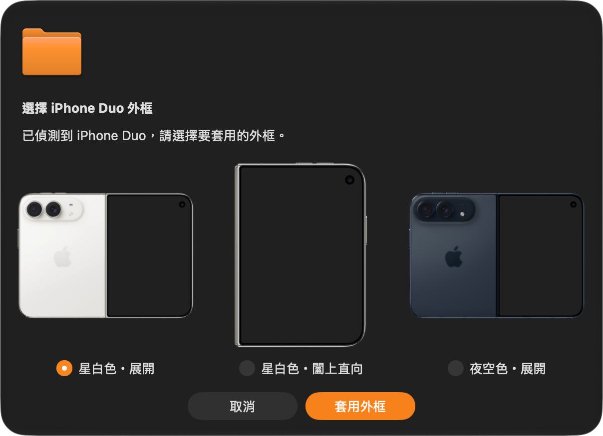

# PreviewBezel

One keystroke to wrap your Xcode Preview screenshot in an iPhone bezel and copy it to the clipboard.

[English](#english) | [繁體中文](#繁體中文)

## English

[繁體中文](#繁體中文)

Press the shortcut you bind in Xcode (e.g. ⌘P) and the tool automatically:

1. Grabs a clean preview render (no status bar, Dynamic Island as a black pill), trying two sources in order:
   - AppleScript clicks the Xcode menu **Editor ▸ Canvas ▸ Copy Preview Screenshot** — captures exactly what the Canvas currently shows (including any interaction state), at native 3x resolution
   - Fallback: the `RenderPreview` tool of the **official Xcode MCP server** (`xcrun mcpbridge`) — rebuilds and renders the initial state of the `#Preview`; it does not reflect Canvas interaction state and returns a lower resolution
2. Detects the device from the screenshot's aspect ratio (iPhone 18 Pro or iPhone Duo). For iPhone Duo, shows three bezel thumbnails to choose from before compositing the screenshot into the transparent screen area with aspect-fill
3. Saves the result to `.build/last-output.png` and puts it back on the clipboard as PNG + TIFF, ready to paste into Slack, slides, or social media

### Install

1. Clone this repo
2. In Xcode ▸ Settings ▸ Behaviors, add a behavior, check **Run**, pick `preview-bezel.sh`, and bind a shortcut (⌘P recommended)
3. On first run, allow the **Accessibility** permission prompt — clicking Xcode's menu requires it; if no prompt appears but the run fails, enable Xcode manually under System Settings ▸ Privacy & Security ▸ Accessibility
4. (Only needed for the fallback) Enable **Xcode Tools** under Xcode ▸ Settings ▸ Intelligence ▸ Model Context Protocol (Xcode 26.3+)

#### About the "Allow "preview-bezel" to access Xcode?" dialog

You only hit this on the MCP fallback path: release builds of Xcode show an approval dialog for every newly launched agent connection, with no "always allow" option. The tool handles it in two layers:

1. After compiling, the binary is re-signed with your Apple Development certificate (override with `PREVIEW_BEZEL_SIGN_ID`) so its signing identity stays stable
2. At runtime, a background watcher detects the approval dialog and **clicks Allow automatically** — only after verifying the dialog text contains this tool's own path, so it never dismisses another agent's dialog (requires Accessibility)

### Usage

1. Open a SwiftUI file in Xcode and let the Canvas preview run
2. Press your bound shortcut
3. For iPhone Duo, select a bezel in the thumbnail dialog and click **套用外框** (Apply bezel). **取消** (Cancel) stops without exporting a new image
4. When the "copied to clipboard" notification appears, just paste

### Bezels

Every `bezel*.png` next to the script is a candidate. The tool detects each transparent screen cutout and identifies the device using the closest aspect ratio. When the match is an iPhone Duo, a dialog lets you choose among all three Duo bezels; other devices keep automatic selection. Add other devices as `bezel-*.png`; name additional Duo variants `bezel-duo-*.png` to include them in the Duo picker.

Bundled bezels from [Apple Design Resources](https://developer.apple.com/design/resources/) (please follow its license terms):

| File | Device | Screen cutout |
| --- | --- | --- |
| `bezel.png` | iPhone 18 Pro (Glacier) | 1206×2622 (1:1 with the preview screenshot) |
| `bezel-duo.png` | iPhone Duo, Star White, outer open (back + outer display) | 914×1330 |
| `bezel-duo-star-white-closed.png` | iPhone Duo, Star White, outer closed portrait | 1398×2034 |
| `bezel-duo-night-sky-open.png` | iPhone Duo, Night Sky, outer open (back + outer display) | 1398×2034 |

The screen area must be transparent; its position is free. The open Duo frames have the display in the right half, while the closed frame has a centered display. The two new PNGs retain their original resolution and transparency.

### How it works

- `preview-bezel.sh`: entry script; recompiles with `swiftc` (and re-signs with your development certificate) whenever the source changes, then runs the binary
- `PreviewBezel.swift`: core logic
  - **Menu source (primary)**: AppleScript (System Events) clicks Copy Preview Screenshot and polls the clipboard's `changeCount` for the screenshot — this captures whatever the Canvas currently displays
  - **MCP fallback**: a minimal built-in MCP client (JSON-RPC over stdio) connects to `xcrun mcpbridge` and calls `XcodeListWindows` → `XcodeGetCurrentFile` (find the .swift file being edited) → `RenderPreview` (render the file's first `#Preview` in its initial state), then reads the returned `previewSnapshotPath`; since Xcode prompts for approval on every agent connection, a background watcher auto-clicks Allow (strictly matched against this tool's own path)
  - Flood-fills transparent pixels inward from the image borders to mark the region outside the phone silhouette; the transparent pixels left over are the screen cutout, and the bounding box of the largest connected one is the screen rectangle (the Dynamic Island and the Duo's camera hole are opaque islands surrounded by it, so they don't affect the box)
  - Compares each bezel's screen aspect ratio against the screenshot's to identify the device; a Duo match opens the bezel picker before compositing
  - Erases aspect-fill overflow that lands outside the silhouette (the screen has rounded corners, so the bounding rectangle's corners stick out past it)
  - Finally draws the bezel on top, writes the PNG, and fills the clipboard

> Note: the Editor menu contains two items named "Canvas" (a visibility toggle and a submenu), and AppleScript rewrites index references stored in variables into name references, so all menu access uses inline index chains — see the comments in `PreviewBezel.swift`.

---

## 繁體中文

[English](#english)

一鍵把 Xcode Preview 截圖套上 iPhone bezel 外框,並複製到剪貼簿。

按下 Xcode 裡綁定的快捷鍵(例如 ⌘P),就會自動:

1. 取得乾淨的 preview 渲染圖(無狀態列、Dynamic Island 為黑色藥丸),依序嘗試兩種來源:
   - AppleScript 點擊 Xcode 選單 **Editor ▸ Canvas ▸ Copy Preview Screenshot**——擷取 Canvas 目前顯示的畫面(含互動後的狀態),原生 3x 解析度
   - 備援:**Xcode 官方 MCP server**(`xcrun mcpbridge`)的 `RenderPreview` 工具——重新建置並渲染 `#Preview` 的初始狀態,不反映 Canvas 互動現況、解析度較低
2. 依截圖長寬比辨識裝置(iPhone 18 Pro 或 iPhone Duo)。iPhone Duo 會先顯示三款外框縮圖供選擇,再把截圖以 aspect-fill 合成進透明螢幕區域
3. 合成結果存到 `.build/last-output.png`,同時以 PNG + TIFF 放回剪貼簿,直接貼到 Slack、簡報或社群

### 安裝

1. Clone 這個 repo
2. 在 Xcode ▸ Settings ▸ Behaviors 新增一個 behavior,勾選 **Run**,選擇 `preview-bezel.sh`,並綁定快捷鍵(建議 ⌘P)
3. 第一次執行時,若系統詢問「輔助使用」(Accessibility)權限,請允許——點擊 Xcode 選單需要這個權限;若沒有跳出詢問但執行失敗,到「系統設定 ▸ 隱私權與安全性 ▸ 輔助使用」手動打開
4. (備援方案才需要)在 Xcode ▸ Settings ▸ Intelligence ▸ Model Context Protocol 啟用 **Xcode Tools**(Xcode 26.3+)

#### 關於「Allow "preview-bezel" to access Xcode?」授權視窗

只有走 MCP 備援時才會遇到:正式版 Xcode 對每次新啟動的 agent 連線都會跳授權視窗,沒有「永久允許」機制。本工具做了兩層處理:

1. 編譯後自動用 Apple Development 憑證重簽 binary(可用 `PREVIEW_BEZEL_SIGN_ID` 指定憑證),讓簽章身分穩定
2. 執行時背景偵測授權視窗,確認內容包含本工具路徑後**自動點擊 Allow**(只點自己的,不會誤點其他 agent 的授權視窗;需要輔助使用權限)

### 使用

1. 在 Xcode 打開 SwiftUI 檔案,讓 Canvas preview 跑起來
2. 按下綁定的快捷鍵
3. 若為 iPhone Duo,在縮圖視窗選擇外框後按「套用外框」;按「取消」則停止,不輸出新圖片
4. 收到「已合成並複製到剪貼簿」通知後直接貼上即可

### 外框(bezel)

腳本旁邊所有 `bezel*.png` 都是候選。程式會偵測各張的透明螢幕挖洞,依最接近截圖的長寬比辨識裝置。若比對到 iPhone Duo,就會跳出視窗供使用者從三款 Duo 外框中選擇;其他裝置維持自動選框。新增其他裝置可使用 `bezel-*.png`;新增 Duo 樣式請命名為 `bezel-duo-*.png`,便會納入 Duo 選擇視窗。

內附的外框來自 [Apple Design Resources](https://developer.apple.com/design/resources/)(使用時請遵守其授權條款):

| 檔案 | 裝置 | 螢幕挖洞 |
| --- | --- | --- |
| `bezel.png` | iPhone 18 Pro(冰川藍) | 1206×2622(與 preview 截圖 1:1) |
| `bezel-duo.png` | iPhone Duo 星白色・展開(背面 ＋ 外螢幕) | 914×1330 |
| `bezel-duo-star-white-closed.png` | iPhone Duo 星白色・闔上直向 | 1398×2034 |
| `bezel-duo-night-sky-open.png` | iPhone Duo 夜空色・展開(背面 ＋ 外螢幕) | 1398×2034 |

螢幕區域必須是透明的,但位置不限:Duo 展開外框的螢幕在右半邊,闔上外框的螢幕則置中。兩張新 PNG 保留原始解析度與透明度。

### 運作原理

- `preview-bezel.sh`:入口腳本,原始碼有更新時自動用 `swiftc` 重新編譯(並用開發憑證重簽),再執行 binary
- `PreviewBezel.swift`:核心邏輯
  - **選單來源(主要)**:用 AppleScript(System Events)點擊 Copy Preview Screenshot,輪詢剪貼簿 `changeCount` 取得截圖——擷取的是 Canvas 當下顯示的畫面
  - **MCP 備援**:內建一個極簡 MCP client(JSON-RPC over stdio),連上 `xcrun mcpbridge` 後依序呼叫 `XcodeListWindows` → `XcodeGetCurrentFile`(取得目前編輯中的 .swift 檔)→ `RenderPreview`(渲染該檔第一個 `#Preview` 的初始狀態),讀取回傳的 `previewSnapshotPath`;Xcode 對每次 agent 連線都會跳授權視窗,工具會背景偵測並自動點 Allow(嚴格比對視窗內容包含本工具路徑,不會誤點其他 agent 的)
  - 從影像四邊往內 flood fill 透明像素,標出手機輪廓以外的區域;剩下的透明像素就是螢幕挖洞,取最大連通區塊的外接矩形當螢幕範圍(Dynamic Island 與 Duo 的鏡頭挖孔是被透明區包住的不透明小島,不影響外接矩形)
  - 比對各 bezel 的螢幕長寬比與截圖長寬比來辨識裝置;若為 Duo,先顯示外框選擇視窗再合成
  - 清除 aspect-fill 溢出到輪廓以外的像素(螢幕是圓角,外接矩形的四角會超出輪廓)
  - 最後把 bezel 疊在最上層,輸出 PNG 並寫入剪貼簿

> 註:Editor 選單有兩個同名的「Canvas」項目(顯示開關與子選單),而且 AppleScript 會把存進變數的索引引用改寫成名稱引用,所以選單存取全部使用行內索引鏈,細節見 `PreviewBezel.swift` 的註解。
